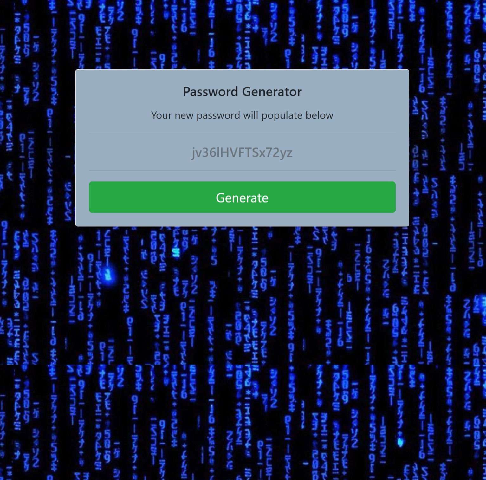

> ## Password Generator!
---
For this small project I built a password generator that can accept parameters from a series of prompts and build a randomized password from the users input. The user can specify the following
- Whether the passcode will include lowercase letters
- Uppercase letters
- Numbers and symbols
- The overall length of the password
---
[Link to the site](https://jpeyton-hub.github.io/PasswordGenerator/)

Please find a screenshot of the website below

Thank you for looking and for any feedback!

